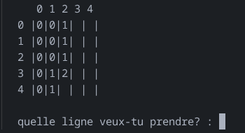
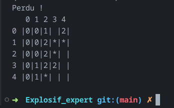

# 💣 Py_Minesweeper (CLI)

> Un jeu de démineur classique entièrement jouable dans le terminal

> Travaux sur :
    - Gestion de grilles 2D
    - algorithmes de propagation (récurcifs)

---

## 📖 Présentation du projet
**Py_Minesweeper** est un jeu de logique où le joueur doit localiser des mines cachées dans une grille sans les faire exploser.


### Utilisation de la Récursion
Pour reproduire le comportement authentique du Démineur : implémentation d'une fonction de **propagation récursive** (open_case()) inspirée de l'algorithme *Flood Fill*.

## 🖼️ Aperçu

| GamePlay | Défaite |
| :---: | :---: |
|  |  |

L'interface (CLI) affiche une grille dynamique où les mines sont représentées par des astérisques (*), tandis que les indicateurs numériques précisent le nombre de menaces présentes dans les cases adjacentes.

---

## 🚀 Installation et Lancement

Ce projet utilise exclusivement les bibliothèques standards de Python, aucune installation externe n'est requise.

1. **Cloner le projet**
   ```bash
   git clone https://github.com/Blackstorme07/Py-Minesweeper
   cd Py-Minesweeper
   python py_minesweeper.py
   ```